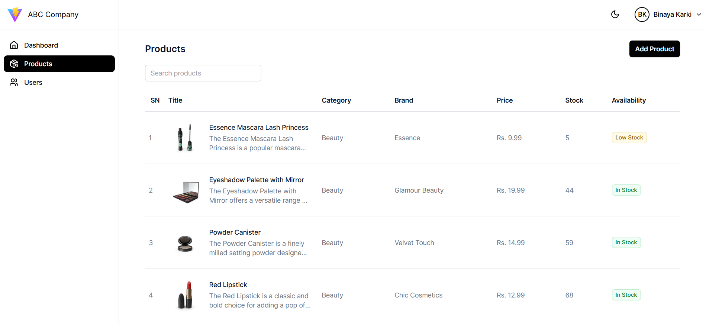

# Dashboard Application

[Demo](https://dashboard-application-binay7587.vercel.app)

A responsive dashboard web application built with React, Redux, TypeScript and Tailwind CSS.

## 🛠️ Tech Stack

- **Frontend Framework:** React + Vite
- **State Management:** Redux Toolkit
- **Styling:** TailwindCSS
- **Type Safety:** TypeScript
- **API Integration:** Axios
- **Version Control:** Git

## 📋 Prerequisites

Before you begin, ensure you have the following installed:

- Node.js (v20.0.0 or higher)
- npm or yarn

## ⚙️ Installation

1. Clone the repository:

```bash
git clone https://github.com/Binay7587/dashboard-application.git
```

2. Install dependencies:

```bash
cd dashboard-application
npm install
```

3. Set up environment variables:

```bash
# Copy the example environment file
cp .env.example .env
```

```bash
# Update the .env file with your API base URL
VITE_API_BASE_URL='https://dummyjson.com'
```

4. Start the development server:

```bash
npm run dev
```

The application will be available at `http://localhost:5173`

## 🚀 Building for Production

```bash
npm run build

```
